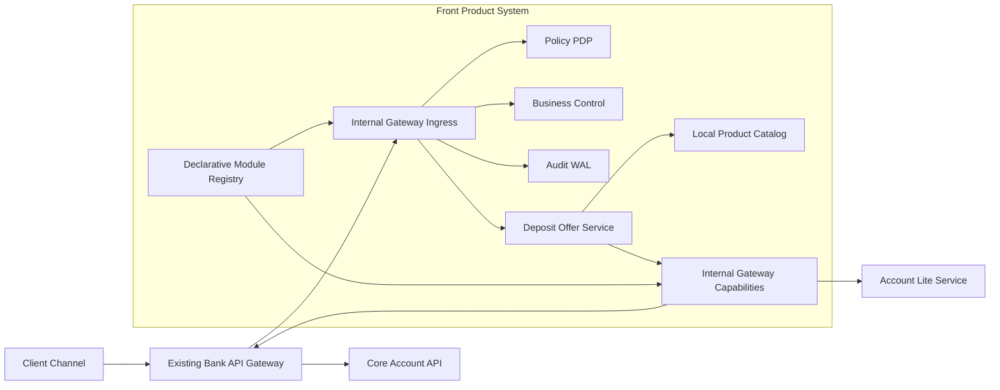
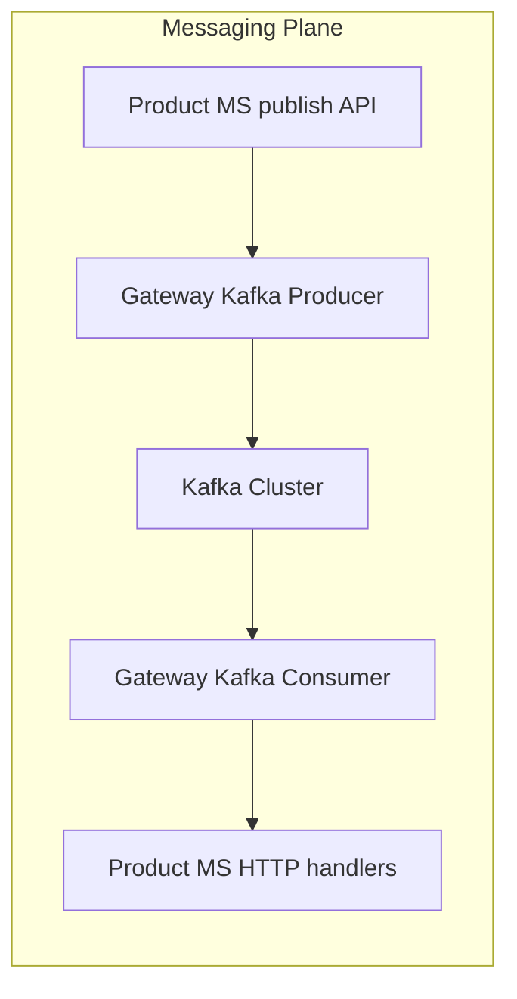

# Internal Gateway: архитектура, DSL и план PoC «Депозитные предложения»

**Версия:** 1.1  
**Статус:** draft для согласования архитекторами и аналитиками  
**Аудитория:** архитекторы, системные и бизнес-аналитики, tech lead, product owner  
**Связанные артефакты:**
- [deposit-opening-gateway.dsl.yaml](../dsl/deposit-opening-gateway.dsl.yaml) — полный концептуальный DSL (HTTP/capabilities)
- [deposit-messaging-gateway.dsl.yaml](../dsl/deposit-messaging-gateway.dsl.yaml) — Kafka publish/consume, fan-out, processor subscription
- [system-platform-boundary.plan.md](../plans/system-platform-boundary_d2ec3495.plan.md) — целевая архитектура gateway
- [deposit-offers-gateway-poc.plan.md](../plans/deposit-offers-gateway-poc_459d38eb.plan.md) — детальный план PoC

---

## 1. Краткое резюме

**Internal Gateway** — внутренний компонент фронтальной продуктовой системы, который:

- принимает запросы от клиентских каналов через существующий **банковский API Gateway**;
- выполняет единообразные технические проверки: access, Business Control, audit, rate limit, retry, circuit breaker;
- проксирует запрос в продуктовый МС с подписанным identity context;
- предоставляет **platform capabilities** (состояние счета, справочники и т.д.) через канонические API;
- позволяет для разных capability использовать **lite-service или прямой банковский API** без изменения продуктового кода;
- может централизовать **Kafka publish/consume**: сертификаты, topic mapping, schema, retry и fan-out в продуктовые МС.

**PoC** строится вокруг нового сервиса **Deposit Offer Service** — подбор депозитных предложений «с нуля», без platform starters/SDK и без прямых зависимостей от lite-service.

Цель PoC — доказать, что продуктовый МС может жить автономно, а платформенная и банковская интеграция централизуется в Gateway.

---

## 2. Проблема, которую решаем

### 2.1. Текущее состояние

- Бывшая общая банковская система разделена на **~40 независимых систем**.
- Для сохранения совместимости в каждую систему «затянуты» старые платформенные МС и **lite-service**.
- Продуктовые МС содержат **platform Java/Spring dependencies**.
- Lite-service под капотом **вызывает друг друга** — полный runtime-граф неявен.
- Обновление Spring Boot / platform library требует **lockstep-цепочки**: платформа → все продуктовые МС → полная регрессия.
- Startup продуктовых МС **медленный** из-за тяжелого classpath.

### 2.2. Что не меняем

- **Банковский API Gateway** остается межсистемной границей: ingress/egress, версионирование внешних API, transport security.
- Internal Gateway решает **только внутреннюю** платформенную границу продуктовой системы.

---

## 3. Целевая архитектура

### 3.1. Контекстная диаграмма



### 3.2. Три логических data plane

| Plane | Назначение | Пример |
|-------|------------|--------|
| **Ingress** | Вход клиентских запросов в продуктовые МС | `POST /deposit-offers/search` |
| **Capabilities** | Синхронные platform/API вызовы продуктовых МС | `GET /internal/capabilities/accounts/{id}/deposit-context` |
| **Messaging** | Асинхронная публикация и доставка событий через Kafka | publish `DepositOffersCalculated`; consume `organization.profile.changed` |

Все plane могут обслуживаться одним deployment, но с **разными listeners, connection pools, consumer groups, concurrency budgets и bulkheads**. Это критично: цепочка `Gateway → Offer Service → Gateway → account provider` не должна исчерпывать ресурсы ingress; Kafka consumer lag не должен блокировать HTTP ingress.



### 3.3. Границы ответственности

#### Internal Gateway делает

- route matching и выбор версии declarative module;
- JSON/OpenAPI schema validation;
- вызов **Business Control** для frontend/simple-backend проверок;
- проверку **Policy/entitlement** (fail-closed);
- security/technical audit;
- identity envelope (подписанный internal JWT);
- retry, circuit breaker, rate limit по профилям;
- общий outbound rate limit на банковские/lite системы;
- request coalescing и cache по политике данных;
- выбор provider (`lite` vs прямой API);
- преобразование ответов в **канонические модели**;
- публикацию событий в Kafka по declarative topic/schema mapping;
- прием Kafka-сообщений и **fan-out** в один или несколько продуктовых МС по правилам маршрутизации;
- централизованное хранение Kafka credentials/сертификатов и schema registry access.

#### Internal Gateway не делает

- продуктовую бизнес-логику и eligibility;
- state machine заявок;
- хранение продуктовых данных;
- orchestration между продуктовыми МС;
- дублирование функций банковского API Gateway;
- замену Kafka как брокера сообщений;
- бизнес-обработку содержимого события — только envelope, routing, delivery guarantees.

#### Продуктовый МС (Deposit Offer Service) делает

- локальный каталог продуктов (в PoC);
- продуктовые правила подбора предложений;
- eligibility на основе канонического account context;
- продуктовый audit event;
- versioned offer snapshots.

#### Продуктовый МС не содержит

- platform starters/SDK;
- lite-service clients;
- DTO внешних систем;
- собственных retry/rate-limit/cache для банковских API;
- прямых Kafka clients и сертификатов целевых кластеров — если публикация/подписка идет через Gateway.

---

## 4. Декларативные модули продуктовых МС

Каждый продуктовый МС владеет **версионируемым YAML-модулем**, который Gateway загружает независимо от своего binary release.

### 4.1. Что модуль описывает

- routes: method, path, target service;
- messaging: publish mappings и inbound fan-out rules;
- request/response schema;
- policy references;
- Business Control control set;
- audit profile;
- resilience profile (timeout, retry, circuit breaker);
- rate limit profile;
- idempotency requirements;
- owner, compatibility, rollout metadata.

### 4.2. Что модуль запрещено описывать

- Java-код, scripts, SQL, циклы;
- сетевые вызовы и orchestration;
- продуктовые лимиты, тарифы, eligibility;
- workflow/state machine;
- прямое указание lite vs bank API (это — provider set Gateway).

### 4.3. Жизненный цикл модуля

1. Модуль хранится рядом с кодом продуктового МС.
2. CI проверяет schema, route conflicts, policy/profile references.
3. Gateway получает модуль через versioned config distribution.
4. Поддерживаются hot reload, canary, rollback без пересборки Gateway.
5. Runtime показывает active module version и resolved dependency graph.

---

## 5. Ключевые механизмы Gateway

### 5.1. Business Control

Gateway вызывает платформенный сервис **Business Control** для:

- получения frontend-описания контролей (для UI);
- backend-проверки простых правил (required fields, formats, simple ranges).

Результат: `PASSED` или список violations + `evaluationId` + `controlSetVersion`. Evidence передается в identity envelope.

**Граница:** Business Control проверяет простые контроли. Продуктовые инварианты (eligibility, доступность продукта) — в продуктовом МС.

### 5.2. Identity envelope

- Банковский API Gateway аутентифицирует пользователя.
- Internal Gateway создает короткоживущий подписанный envelope для продуктового МС.
- Claims: `subjectId`, `organizationId`, `authStrength`, `sessionId`, `operationId`, `businessControlEvidenceId`.
- mTLS между Gateway и продуктовым МС.
- `accountId`, `amount`, `term` из payload — **не доверенные** claims.

### 5.3. Provider selection (lite vs bank API)

```yaml
providerSets:
  account-context-provider:
    selection:
      strategy: explicit-versioned-alias
      configurationKey: deposit.account-context.active-provider
      defaultAlias: legacy-lite
      automaticFallback: false   # без доказанной эквивалентности!
    providers:
      legacy-lite: { ... }
      core-banking: { ... }
```

- Переключение provider — **конфигурацией Gateway**, без релиза продуктов.
- Автоматический fallback между semantically different providers **запрещен**.
- Shadow comparison для проверки эквивалентности перед cutover.

### 5.4. Retry

| Тип операции | Retry | Условия |
|--------------|-------|---------|
| Safe GET (account context) | Да | transient errors (502, 503, timeout) |
| Safe GET (organization name) | Да | transient errors |
| POST с idempotency key | Да | только при downstream idempotency contract |
| POST без idempotency | Нет | |
| 4xx / business rejection | Нет | |

### 5.5. Rate limiting

**Два уровня:**

1. **Per-caller** — защита от злоупотребления одним МС/пользователем.
2. **Shared outbound budget** — защита банковской/lite системы от суммарной нагрузки всех МС и Gateway instances.

Пример: десять МС одновременно запрашивают состояние счета — Gateway видит общий RPS и ограничивает downstream.

### 5.6. Cache и request coalescing

| Данные | Cache | Coalescing | Обоснование |
|--------|-------|------------|-------------|
| Состояние счета | Нет | Да | Должно быть актуально; одинаковые concurrent requests объединяются |
| Название организации | Да (15 min TTL) | Нет | Справочные данные; authorization before lookup |
| Business Control definitions | Да (5 min) | Нет | Версионированные правила |
| Business Control evaluation | Нет | Нет | Каждый запрос уникален |

### 5.7. Audit

| Уровень | Кто | Что |
|---------|-----|-----|
| Security/technical | Gateway | кто, policy decision, route, provider, latency, outcome |
| Business | Продуктовый МС | что рассчитано, почему отклонено, snapshot versions |

Связка через `operationId`, `traceId`, `correlationId`.

### 5.8. Kafka через Gateway

Сейчас продуктовые МС часто подключаются к Kafka **напрямую**, если сертификат системы добавлен в целевой кластер. Это размножает:

- Kafka client libraries в classpath;
- topic names и schema version в коде;
- retry/DLQ policy по командам;
- operational burden при ротации сертификатов.

Gateway может стать **единой messaging boundary** внутри продуктовой системы.

#### 5.8.1. Outbound: публикация события продуктом

Продуктовый МС не пишет в Kafka напрямую. Он вызывает Gateway:

`POST /internal/messaging/publish`

и передает **каноническое доменное событие**. Gateway по mapping:

- выбирает target cluster/topic;
- применяет schema registry / Avro/JSON schema;
- добавляет стандартные headers: `eventId`, `eventType`, `schemaVersion`, `correlationId`, `causationId`, `sourceSystem`, `sourceService`;
- выполняет retry и dead-letter policy;
- пишет technical audit «событие принято к доставке / доставлено / отложено».

**Семантика для продукта:** событие считается принятым Gateway после durable acceptance (локальный WAL/outbox Gateway), а не после commit offset downstream consumer.

Пример для Deposit Offer Service:

- canonical event: `DepositOffersCalculated`
- mapping: topic `front.deposit.offers.v1`, key = `organizationId`

#### 5.8.2. Inbound: listener и fan-out в продуктовые МС

Gateway подписывается на inbound topic(и) **одним consumer group** и по declarative rules решает, в какие продуктовые МС прокинуть сообщение.

**Пример A — fan-out справочного события:** `organization.profile.changed` → несколько МС для cache invalidation.

**Пример B — подписка на Kafka депозитного процессора:** topic `deposit.processor.offer.lifecycle.v1` → **только** `deposit-offer-service` для синхронизации каталога предложений:

| eventType | Действие в Deposit Offer Service |
|-----------|----------------------------------|
| `DepositOfferCreated` | Добавить/активировать продукт в локальном каталоге |
| `DepositOfferUpdated` | Обновить ставки, сроки, лимиты, version snapshot |
| `DepositOfferClosed` | Деактивировать предложение; новый search его не возвращает |

Типовые режимы fan-out:

| Режим | Когда использовать |
|-------|-------------------|
| **single-target** | Событие относится к одному owner-сервису |
| **broadcast** | Справочное событие нужно нескольким МС (например, cache invalidation) |
| **filtered-multicast** | Разным МС нужны разные подмножества событий по `eventType`/headers |

Gateway **не интерпретирует бизнес-смысл**, а только:

- валидирует envelope/schema;
- проверяет, что источник сообщения доверенный;
- deduplicate по `eventId`;
- маршрутизирует в HTTP handler целевого МС с signed delivery envelope;
- применяет retry/backoff/DLQ на доставку в продукт;
- фиксирует delivery audit.

Пример:

- topic: `bank.organization.profile.changed.v1`
- fan-out: `deposit-offer-service`, `document-service`, `notification-service`
- каждый target получает тот же canonical event, но со своим `audience` и delivery policy.

#### 5.8.3. Границы и ограничения

**Gateway делает хорошо:**

- централизует certs и доступ к Kafka;
- скрывает физические topic/cluster names;
- дает единый retry/DLQ/rate limit;
- позволяет менять target topic без релиза продукта;
- делает видимым messaging dependency graph.

**Gateway не должен:**

- содержать бизнес-правила «если депозит, то вызвать еще три сервиса»;
- выполнять saga/choreography;
- хранить продуктовое состояние между сообщениями;
- автоматически fan-out «на все МС системы» без явного declarative rule.

**Важно:** fan-out в пять продуктовых МС — это **parallel delivery**, а не orchestration. Каждый МС обрабатывает событие независимо и idempotently.

#### 5.8.4. Delivery guarantees

| Направление | Рекомендуемая семантика |
|-------------|-------------------------|
| Product → Gateway publish | at-least-once acceptance; dedup по `eventId` |
| Gateway → Kafka | at-least-once produce; idempotent producer where supported |
| Kafka → Gateway consume | at-least-once consume; commit offset после durable routing decision |
| Gateway → Product MS | at-least-once HTTP delivery; product dedup by `eventId` |

#### 5.8.5. Отношение к PoC

Kafka **не обязателен** для первого HTTP PoC deposit-offers, но архитектура должна предусматривать messaging plane. Рекомендуемый **этап 2** после HTTP PoC:

1. **Подписка на Kafka депозитного процессора** — `DepositOfferCreated/Updated/Closed` → синхронизация каталога в Deposit Offer Service;
2. publish `DepositOffersCalculated` через Gateway (опционально, для downstream analytics);
3. consume `organization.profile.changed` с fan-out и cache invalidation.

---

## 6. Плюсы и минусы

### 6.1. Плюсы

| # | Преимущество | Пояснение |
|---|--------------|-----------|
| 1 | **Поэтапная миграция lite → bank API** | Переключение provider конфигурацией, canary, rollback |
| 2 | **Разрыв lockstep-зависимости** | Обновление Gateway/platform не требует пересборки продуктов при сохранении контракта |
| 3 | **Быстрый startup продуктов** | Нет platform starters, auto-config, transitive deps |
| 4 | **Явный dependency graph** | Видно: route → policy → BC → provider → bank/lite |
| 5 | **Защита банковских систем** | Общий outbound rate limit, coalescing, circuit breaker |
| 6 | **Единый retry/cache policy** | Централизованно, без размножения по МС |
| 7 | **Канонические контракты** | Продукт не знает DTO lite/bank API |
| 8 | **Независимый rollout модулей** | Команда продукта меняет routes без релиза Gateway |
| 9 | **Операционная гибкость** | Отключить route, снизить limit, открыть breaker — без релиза продуктов |
| 10 | **Упрощение тестирования** | Contract tests Gateway↔product, Gateway↔provider отдельно |
| 11 | **Централизация Kafka** | Certs, topic mapping, schema и retry/DLQ без Kafka clients в продуктах |
| 12 | **Fan-out inbound events** | Одно bank/platform событие доставляется в несколько МС по declarative rules |

### 6.2. Минусы и риски

| # | Риск | Митигация |
|---|------|-----------|
| 1 | Gateway как SPOF | HA (2+ instances), bulkheads, capacity test |
| 2 | Дополнительная latency | Latency budget, async audit, cache где допустимо |
| 3 | Новый Tier-0 компонент | On-call, SLO, DR, runbooks |
| 4 | DSL может разрастись | Запрет scripts/functions; architecture review расширений |
| 5 | Gateway team как bottleneck | Self-service module publishing; ownership по capability |
| 6 | Циклический путь Gateway→Service→Gateway | Разные listeners/pools/budgets для ingress и capabilities |
| 7 | Семантическая разница lite/bank | Canonical contract, shadow comparison, controlled cutover |
| 8 | Distributed rate limiter — новая зависимость | Отказоустойчивый counter backend; degradation mode |
| 9 | Cache может раскрыть данные | Authorization before lookup; tenant-aware keys; allowlist полей |
| 10 | Стоимость первоначальной реализации | Поэтапный PoC; reuse готового proxy runtime |
| 11 | Fan-out может создать шум/дубли | Explicit target list, dedup, idempotent handlers в продуктах |
| 12 | Messaging lag влияет на cache invalidation | Отдельный consumer group, мониторинг lag, DLQ и replay tooling |

### 6.3. Когда НЕ стоит делать Gateway

- Если продуктовый МС не использует платформенные capabilities.
- Если все platform services уже имеют стабильные thin HTTP APIs без hidden deps.
- Если команда не готова поддерживать Tier-0 компонент.

---

## 7. PoC: Deposit Offer Service

### 7.1. Scope PoC

**Входит:**
- Internal Gateway (ingress + capabilities);
- новый Deposit Offer Service без platform dependencies;
- реальный Business Control и Policy;
- реальный account provider (lite + Core Account API);
- локальный каталог депозитных продуктов в БД сервиса;
- organization display capability с cache;
- retry, rate limit, coalescing, circuit breaker;
- canary переключение lite → Core Account API.

**Не входит в этап 1 (HTTP PoC):**
- создание заявки, подпись, исполнение в Deposit Processor;
- все платформенные сервисы;
- production hardening (DR, security certification).

**Этап 2 (Messaging PoC) — рекомендуется сразу после успешного HTTP PoC:**
- подписка Gateway на Kafka депозитного процессора (`Created/Updated/Closed`);
- синхронизация локального каталога Deposit Offer Service из authoritative processor events;
- dedup, ordering по `processorOfferId`, DLQ и replay;
- без прямого Kafka client в Deposit Offer Service.

### 7.2. Пользовательский сценарий

1. Клиент запрашивает депозитные предложения: организация, счет, сумма, срок.
2. Банковский API Gateway → Internal Gateway.
3. Gateway: schema → Business Control → Policy → audit → identity envelope → proxy.
4. Deposit Offer Service запрашивает `AccountDepositContext` через capability plane.
5. Gateway: rate limit → coalescing → provider (lite/core) → canonical response.
6. Сервис читает локальный каталог, применяет eligibility, формирует предложения.
7. При необходимости — `OrganizationDisplayInfo` через Gateway (с cache).
8. Ответ: `offerId`, product version, rate, expiry, snapshot sources.

### 7.2.1. Сценарий этапа 2: синхронизация каталога из процессора

1. Депозитный процессор публикует в свой Kafka topic событие `DepositOfferCreated/Updated/Closed`.
2. Internal Gateway — единственный consumer с сертификатом системы в кластере процессора.
3. Gateway валидирует envelope, dedup по `eventId`, нормализует в canonical event.
4. Gateway доставляет HTTP POST в `deposit-offer-service` на route по `eventType`.
5. Deposit Offer Service upsert/deactivate запись в локальном каталоге с `processorOfferId` и `processorOfferVersion`.
6. Клиентский `POST /deposit-offers/search` использует уже синхронизированный каталог; ручной seed больше не нужен.
7. При `DepositOfferClosed` существующие расчёты остаются воспроизводимы по snapshot version; новые search не показывают закрытое предложение.

### 7.3. Контракты PoC

| Endpoint | Plane | Описание |
|----------|-------|----------|
| `GET /deposit-products/{productId}/offer-controls` | Ingress | Frontend-контроли из Business Control |
| `POST /deposit-offers/search` | Ingress | Поиск предложений (read-only) |
| `GET /internal/capabilities/accounts/{accountId}/deposit-context` | Capability | Актуальное состояние счета |
| `GET /internal/capabilities/organizations/{orgId}/display-info` | Capability | Кэшируемое имя организации |

**Messaging (этап 2):**

| Binding | Направление | Описание |
|---------|-------------|----------|
| `deposit-processor-offer-lifecycle` | Kafka → Gateway → Offer Service | Created/Updated/Closed предложения процессора |
| `organization-profile-changed` | Kafka → Gateway → N МС | Cache invalidation |
| `publish-deposit-offers-calculated` | Offer Service → Gateway → Kafka | Опционально: audit/analytics downstream |

### 7.4. Модель данных Deposit Offer Service

```
DepositProduct
  - id, version, currency
  - activeFrom, activeTo
  - minAmount, maxAmount
  - allowedTerms[]

RateTier
  - productId
  - amountFrom, amountTo
  - termFrom, termTo
  - interestRate

OfferCalculation (audit/snapshot)
  - requestFingerprint
  - productVersion
  - accountSnapshotTimestamp
  - calculatedOffers[]
  - expiresAt

ProcessorOfferCatalogEntry (sync from processor via Gateway)
  - processorOfferId
  - processorOfferVersion
  - status: ACTIVE | CLOSED
  - productCode, currency, rateTiers, terms, limits
  - lastEventId, lastOccurredAt
  - source: deposit-processor-kafka
```

---

## 8. Примеры DSL для PoC

Полный DSL: [deposit-opening-gateway.dsl.yaml](../dsl/deposit-opening-gateway.dsl.yaml).  
Ниже — фрагменты, специфичные для **deposit-offers** PoC.

### 8.1. Метаданные модуля

```yaml
apiVersion: bank.internal-gateway/v1alpha1
kind: ProductModule

metadata:
  name: deposit-offers
  version: 1.0.0
  owner: deposit-offers-team
  system: front-product-system
  description: Подбор депозитных предложений
```

### 8.2. Route: поиск предложений

```yaml
routes:
  - id: search-deposit-offers
    exposure: bank-ingress
    request:
      method: POST
      path: /deposit-offers/search
      schema: searchOffersRequest
      idempotency:
        safe: true
    identityContext: bankUser
    validation:
      schema:
        enabled: true
      businessControl:
        providerSet: business-control-provider
        operation: evaluate-controls
        controlSet: deposit.offers.search
        stages: [frontend, backend-simple]
        effect: fail-closed
        input:
          payload: request:///
          subjectId: claim://subjectId
          organizationId: claim://organizationId
        result:
          evidence:
            includeInForwardedEnvelope: true
    authorization:
      effect: fail-closed
      policy: deposit.offers.search
    auditProfile: securityCommand
    rateLimitProfile: searchDepositOffers
    resilienceProfile: depositOfferCommand
    target:
      service: deposit-offer-service
      method: POST
      path: /internal/v1/offers/search
```

### 8.3. Capability: состояние счета (без cache, с coalescing)

```yaml
capabilities:
  - id: account-deposit-context
    exposure: internal
    request:
      method: GET
      path: /internal/capabilities/accounts/{accountId}/deposit-context
    allowedCallers: [deposit-offer-service]
    authorization:
      policy: account.read-for-deposit-opening
      effect: fail-closed
    outboundRateLimitProfile: coreAccountsSharedBudget
    resilienceProfile: accountContextQuery
    providerSet: account-context-provider
    canonicalResponse:
      schema: accountDepositContext
      freshness:
        maxAge: 0s
        staleAllowed: false
    failure:
      mode: fail-closed
```

```yaml
profiles:
  resilience:
    accountContextQuery:
      timeout: 1200ms
      retries:
        policy: safe-query
        maxAttempts: 2
        retryOn: [connect-timeout, http-502, http-503, http-504]
      cache:
        mode: disabled
      requestCoalescing:
        enabled: true
        key: [accountId, organizationId]
        maxWait: 1200ms
        retainAfterCompletion: 0s
```

### 8.4. Capability: название организации (с cache)

```yaml
capabilities:
  - id: organization-display-info
    exposure: internal
    request:
      method: GET
      path: /internal/capabilities/organizations/{organizationId}/display-info
    resilienceProfile: organizationDisplayQuery
    security:
      authorizeBeforeCacheLookup: true
      cacheContainsOnlyAllowlistedFields: true
```

```yaml
profiles:
  resilience:
    organizationDisplayQuery:
      cache:
        mode: read-through
        ttl: 15m
        staleWhileRevalidate: 5m
        key: [organizationId, locale]
        storeFields: [organizationId, displayName, shortName, legalForm]
        invalidateOn:
          event: organization.profile.changed
```

### 8.5. Provider set: lite vs Core Account API

```yaml
providerSets:
  account-context-provider:
    selection:
      strategy: explicit-versioned-alias
      configurationKey: deposit.account-context.active-provider
      defaultAlias: legacy-lite
      automaticFallback: false
    providers:
      legacy-lite:
        type: internal-service
        service: account-lite-service
        method: GET
        path: /v2/accounts/{accountId}
        responseMapping:
          accountId: response:///id
          status: { source: response:///state, enum: { OPEN: ACTIVE } }
          debitAllowed: response:///permissions/debit

      core-banking:
        type: bank-api
        via: existing-bank-api-gateway
        system: core-accounts
        apiVersion: v4
        method: GET
        path: /accounts/{accountId}/deposit-opening-context
        responseMapping:
          accountId: response:///accountId
          status: response:///status
          debitAllowed: response:///operations/debitAllowed
```

### 8.6. Shared outbound rate limit

```yaml
profiles:
  rateLimits:
    coreAccountsSharedBudget:
      direction: outbound
      scope: [selectedProvider, operation]
      distributedAcrossGatewayInstances: true
      sustained: 300/second
      burst: 60
      maxConcurrentRequests: 100
      fairness:
        key: workload
        minimumSharePerWorkload: 5/second
        preventSingleConsumerExhaustion: true
```

### 8.7. Messaging: publish события из продукта

Продуктовый МС публикует **каноническое событие**, Gateway мапит его в Kafka topic.

```yaml
messaging:
  publishRoutes:
    - id: publish-deposit-offers-calculated
      exposure: internal
      allowedCallers: [deposit-offer-service]
      request:
        method: POST
        path: /internal/messaging/publish/deposit-offers-calculated
        schema: depositOffersCalculatedEvent
        idempotency:
          required: true
          sourceField: /eventId
      authorization:
        policy: deposit.offers.publish-events
        effect: fail-closed
      auditProfile: platformQuery
      resilienceProfile: kafkaPublishCommand
      mapping:
        eventType: DepositOffersCalculated
        providerSet: front-deposit-kafka
        topicAlias: deposit-offers-calculated
        messageKey: request:///organizationId
        headers:
          eventId: request:///eventId
          schemaVersion: request:///schemaVersion
          correlationId: envelope://correlationId
          sourceService:
            constant: deposit-offer-service
        payload: request:///
      acceptance:
        mode: durable-local-wal
        exposeAsAccepted: true

providerSets:
  front-deposit-kafka:
    selection:
      strategy: fixed
      provider: front-system-kafka
    providers:
      front-system-kafka:
        type: kafka-cluster
        cluster: front-product-system-kafka
        auth: mtls-service-account
        topics:
          deposit-offers-calculated:
            physicalTopic: front.deposit.offers.calculated.v1
            schema: registry://events/deposit-offers-calculated/v1
            acks: all
            idempotentProducer: true
```

**Что получает продукт:** HTTP 202 + `acceptanceId`.  
**Что делает Gateway:** сертификат, topic, schema, retry, DLQ, audit.  
**Что остается в продукте:** формирование доменного события и dedup по `eventId` при повторной отправке.

### 8.8. Messaging: inbound listener и fan-out

Gateway слушает bank/platform topic и доставляет сообщение в несколько продуктовых МС.

```yaml
messaging:
  consumeBindings:
    - id: organization-profile-changed
      providerSet: bank-platform-kafka
      source:
        topicAlias: organization-profile-changed
        consumerGroup: internal-gateway.front-system.organization-profile
        startingOffset: latest
        trustedProducers:
          - bank-organization-directory
      envelope:
        schema: organizationProfileChangedEvent
        requiredHeaders:
          - eventId
          - eventType
          - schemaVersion
          - occurredAt
      deduplication:
        key: header://eventId
        store: gateway-event-dedup
        ttl: 7d
      fanOut:
        mode: filtered-multicast
        targets:
          - id: invalidate-offer-org-cache
            filter:
              eventType: OrganizationProfileChanged
            delivery:
              service: deposit-offer-service
              method: POST
              path: /internal/v1/events/organization-profile-changed
              audience: deposit-offer
              resilienceProfile: internalEventDelivery
              retry:
                maxAttempts: 5
                backoff: exponential-jitter
              deadLetter:
                topicAlias: gateway-delivery-dlq
                retainForReplay: true

          - id: invalidate-document-org-cache
            filter:
              eventType: OrganizationProfileChanged
            delivery:
              service: document-service
              method: POST
              path: /internal/v1/events/organization-profile-changed
              audience: document-service

          - id: refresh-notification-templates
            filter:
              eventType: OrganizationProfileChanged
              changedFieldsContainsAny: [displayName, legalForm]
            delivery:
              service: notification-service
              method: POST
              path: /internal/v1/events/organization-profile-changed
              audience: notification-service
      commitPolicy:
        mode: after-durable-routing-decision
        note: Offset commit только после записи delivery tasks / DLQ decision

providerSets:
  bank-platform-kafka:
    providers:
      bank-platform-kafka:
        type: kafka-cluster
        cluster: bank-platform-kafka
        auth: mtls-system-certificate
        topics:
          organization-profile-changed:
            physicalTopic: bank.organization.profile.changed.v1
            schema: registry://events/organization-profile-changed/v1
          gateway-delivery-dlq:
            physicalTopic: front.gateway.delivery.dlq.v1
```

**Важно:**

- fan-out — это **parallel delivery**, не orchestration;
- каждый target обязан быть idempotent по `eventId`;
- фильтры только по envelope/metadata, не по бизнес-правилам;
- один consumer group на binding, чтобы не размножать чтение topic всеми МС.

### 8.9. Messaging: подписка на Kafka депозитного процессора

Gateway подписывается на topic процессора и доставляет lifecycle-события предложений в Deposit Offer Service.

```yaml
messaging:
  consumeBindings:
    - id: deposit-processor-offer-lifecycle
      providerSet: deposit-processor-kafka
      source:
        topicAlias: deposit-processor-offer-events
        consumerGroup: internal-gateway.front-system.deposit-processor-offers
        trustedProducers: [deposit-processing-system]
      envelope:
        schema: processorDepositOfferEvent
        allowedEventTypes:
          - DepositOfferCreated
          - DepositOfferUpdated
          - DepositOfferClosed
      deduplication:
        key: header://eventId
        ttl: 30d
      ordering:
        key: header://processorOfferId
        mode: per-key-serial-delivery
      fanOut:
        mode: single-target-filtered
        targets:
          - id: sync-offer-catalog
            filter:
              eventTypeAny:
                - DepositOfferCreated
                - DepositOfferUpdated
                - DepositOfferClosed
            delivery:
              service: deposit-offer-service
              pathByEventType:
                DepositOfferCreated: /internal/v1/events/deposit-processor/offer-created
                DepositOfferUpdated: /internal/v1/events/deposit-processor/offer-updated
                DepositOfferClosed: /internal/v1/events/deposit-processor/offer-closed

providerSets:
  deposit-processor-kafka:
    providers:
      deposit-processor-kafka:
        type: kafka-cluster
        cluster: deposit-processor-kafka
        auth: mtls-system-certificate
        certificateSource: gateway-managed
        topics:
          deposit-processor-offer-events:
            physicalTopic: deposit.processor.offer.lifecycle.v1
            schema: registry://deposit-processor/offer-lifecycle/v1
```

**Поведение Deposit Offer Service по eventType:**

| eventType | HTTP handler | Действие |
|-----------|--------------|----------|
| `DepositOfferCreated` | `.../offer-created` | Upsert ACTIVE, сохранить processorOfferVersion |
| `DepositOfferUpdated` | `.../offer-updated` | Update tiers/limits только если version выше текущей |
| `DepositOfferClosed` | `.../offer-closed` | status=CLOSED; search фильтрует ACTIVE |

**Зачем через Gateway, а не direct Kafka:**

- сертификат процессора хранится только в Gateway;
- продукт не тянет Kafka client и Avro/schema deps;
- единый dedup, DLQ, lag monitoring и replay;
- смена physical topic/schema — конфигурацией Gateway.

Полный messaging DSL: [deposit-messaging-gateway.dsl.yaml](../dsl/deposit-messaging-gateway.dsl.yaml).

---

## 9. План реализации PoC

### 9.1. Этапы

| Этап | Срок | Содержание | Результат |
|------|------|------------|-----------|
| **0. Baseline** | 1–2 нед | Контракты, ADR, baseline startup/latency, тестовые контуры | Утвержденные контракты и baseline |
| **1. Gateway foundation** | 2 нед | HA deployment, module loader, ingress/capability planes, identity, observability | Запрос через Gateway в stub |
| **2. Platform integrations** | 2–3 нед | Business Control, Policy, Audit, account/org providers, resilience | Канонические capability responses |
| **3. Deposit Offer Service** | 2–3 нед | Сервис, каталог, eligibility, offer calculation | Подбор на реальном account context |
| **4. Validation** | 2 нед | E2E, load, failure injection, canary lite→core | Доказанные критерии успеха |
| **5. Итоги** | 1 нед | Отчет, экономика, go/no-go | Решение о масштабировании |
| **6. Messaging (опц.)** | 2–3 нед | Processor offer subscription, catalog sync, dedup/ordering/DLQ | Каталог из процессора без Kafka client в продукте |

**Общий срок:** 8–12 недель (этап 1); +2–3 недели при включении messaging этапа 2.

### 9.2. Команда

| Роль | FTE |
|------|-----|
| Tech lead / architect | 0.5–1 |
| Gateway engineers | 2 |
| Deposit Offer Service engineers | 2 |
| QA / performance | 1 |
| DevOps / SRE | 0.5–1 |
| IAM, BC, security, account owners | part-time |

### 9.3. Оценка трудозатрат

| Компонент | Чел.-дн. |
|-----------|----------|
| Gateway foundation + DSL | 55–85 |
| Policy, BC, audit, identity | 30–45 |
| Account/org providers, resilience | 30–50 |
| Deposit Offer Service + каталог | 40–65 |
| Infrastructure, tests, performance | 25–55 |
| **Итого PoC** | **180–300** |

Production hardening после PoC: еще **150–300 чел.-дн.**

---

## 10. Критерии успеха PoC

- [ ] Deposit Offer Service **не содержит** platform starters/SDK/lite clients в dependency tree.
- [ ] Переключение `account-lite → Core Account API` — **конфигурацией Gateway**, без rebuild Offer Service.
- [ ] Business Control реально проверяет controls и возвращает versioned evidence.
- [ ] Состояние счета **никогда** не отдается из cache.
- [ ] 10 параллельных одинаковых account queries → **не более 1** downstream call (coalescing).
- [ ] Shared outbound budget соблюдается для нескольких МС и Gateway instances.
- [ ] Organization cache: authorization before lookup, invalidation работает.
- [ ] Safe retries не вызывают side effects.
- [ ] Dependency graph виден в traces/metrics.
- [ ] Gateway p95 overhead в бюджете; startup Offer Service существенно быстрее baseline.
- [ ] Spring upgrade Gateway не требует пересборки Offer Service при неизменном контракте.
- [ ] Canary и rollback provider без изменения продуктового кода.

**Этап 2 (Messaging):**

- [ ] Deposit Offer Service **не имеет** Kafka client / сертификата процессора.
- [ ] `DepositOfferCreated/Updated/Closed` из processor topic синхронизируют локальный каталог.
- [ ] Повторное событие с тем же `eventId` не создает дубль (dedup).
- [ ] `DepositOfferUpdated` с меньшей `processorOfferVersion` игнорируется (optimistic version).
- [ ] `DepositOfferClosed` исключает предложение из новых search, но сохраняет историю snapshot.
- [ ] Consumer lag и DLQ мониторятся; replay из DLQ документирован.

---

## 11. Чеклист для архитекторов

### Перед стартом PoC

- [ ] Зафиксирован baseline startup/latency/classpath аналогичного МС.
- [ ] Утверждены канонические контракты: `DepositOffer`, `AccountDepositContext`, `OrganizationDisplayInfo`.
- [ ] Согласованы policy names и Business Control control sets.
- [ ] Выбран готовый proxy runtime (Envoy/Kong/Spring Cloud Gateway).
- [ ] Оформлен ADR с границами Gateway.
- [ ] Подготовлены тестовые контуры account-lite и Core Account API.
- [ ] Определен latency budget для Gateway.

### Архитектурные ограничения (must have)

- [ ] Запрет platform Java/Spring dependencies в продуктовых МС (architecture tests).
- [ ] Запрет executable code в DSL modules.
- [ ] Запрет automatic fallback между semantically different providers.
- [ ] Authorization before cache lookup.
- [ ] Fail-closed для Policy и Business Control.
- [ ] Раздельные bulkheads для ingress и capabilities.
- [ ] mTLS + signed identity envelope между Gateway и продуктами.

### После PoC (go/no-go)

- [ ] Все критерии успеха выполнены.
- [ ] Фактические трудозатраты vs план.
- [ ] Решение о production hardening.
- [ ] Backlog следующих capability (signing, audit transport, files).
- [ ] План миграции legacy МС на Gateway.

---

## 12. Чеклист для аналитиков

### Контракты и сценарии

- [ ] Описан happy path: поиск предложений.
- [ ] Описаны negative cases: нет прав, счет заблокирован, продукт недоступен, BC violations.
- [ ] Определены frontend controls для Business Control set `deposit.offers.search`.
- [ ] Определены backend-simple controls (amount > 0, term > 0, required fields).
- [ ] Определены продуктовые правила eligibility (в Offer Service, не в Gateway).
- [ ] Описан audit trail: security (Gateway) + business (Offer Service).
- [ ] Описаны processor events: Created/Updated/Closed и mapping в catalog entry.
- [ ] Определены idempotency rules по `eventId` и version rules по `processorOfferVersion`.

### Данные

- [ ] Модель `DepositProduct` и `RateTier` для локального каталога PoC.
- [ ] Модель `OfferCalculation` для snapshot/audit.
- [ ] Каноническая модель `AccountDepositContext` (поля, enum status).
- [ ] Каноническая модель `OrganizationDisplayInfo`.

### Нефункциональные требования

- [ ] SLO для Gateway и Offer Service.
- [ ] Нагрузочный профиль PoC (RPS, concurrent users).
- [ ] Latency budget (Gateway overhead, end-to-end).
- [ ] Retention policy для audit events.

### Acceptance criteria

- [ ] Критерии успеха из раздела 10 согласованы с PO.
- [ ] Определены метрики для go/no-go.
- [ ] Описаны failure scenarios для тестирования.

---

## 13. Дальнейшее развитие после PoC

### 13.1. Следующие capability для Gateway

1. Audit transport (асинхронная доставка в central sink).
2. Kafka messaging plane: processor offer subscription, `DepositOffersCalculated`, `organization.profile.changed`.
3. Customer signing integration.
4. File metadata / signed URL.
5. Deposit application workflow (state machine).
6. Deposit Processor command integration (async execute application).

### 13.2. Миграция legacy МС

1. Построить dependency graph текущих lite-service.
2. Создать declarative module + proxy в текущую реализацию.
3. Вынести access, audit, resilience в Gateway.
4. Shadow comparison.
5. Перевод продуктовых МС вертикальными срезами.
6. Замена provider внутри Gateway (lite → bank API).
7. Удаление platform dependencies из продуктов.
8. Deprecation legacy lite-service.

### 13.3. Экономический эффект (ориентир)

При 40 продуктовых МС и 3–4 platform upgrade-волнах в год:

- текущая модель: ~40 МС × 3–4 дня × 3–4 волны ≈ **480–640 чел.-дн./год** на lockstep;
- целевая модель: обновление Gateway/adapters + точечная регрессия ≈ **80–150 чел.-дн./год**;
- потенциальная экономия: **300–500 чел.-дн./год** (1.5–2.5 FTE).

PoC должен дать фактические цифры для уточнения.

---

## 14. Глоссарий

| Термин | Определение |
|--------|-------------|
| **Internal Gateway** | Внутренний компонент продуктовой системы для platform enforcement и capability access |
| **Declarative module** | YAML-описание routes, policies, profiles продукта; без executable code |
| **Ingress plane** | Обработка входящих клиентских запросов |
| **Capability plane** | Внутренние platform API для продуктовых МС |
| **Provider set** | Набор источников данных (lite/bank API) с explicit selection |
| **Identity envelope** | Подписанный internal JWT с claims для продуктового МС |
| **Business Control** | Платформенный сервис простых frontend/backend проверок |
| **Canonical model** | Стабильная модель Gateway, скрывающая DTO lite/bank |
| **Request coalescing** | Объединение одинаковых concurrent requests в один downstream call |
| **Shared outbound budget** | Общий rate limit на банковскую/lite систему от всех МС |
| **Messaging plane** | Publish/consume Kafka через Gateway с mapping и fan-out |
| **Fan-out** | Доставка одного inbound-события в несколько продуктовых МС по rules |
| **Durable acceptance** | Gateway принял событие к доставке и сохранил его локально до успешного produce |

---

## 15. Открытые вопросы для согласования

1. Какой proxy runtime выбрать (Envoy/Kong/другое)?
2. Где хранить distributed rate limit counters?
3. Какой SLA для Business Control и Policy PDP?
4. Нужен ли central module registry или достаточно GitOps?
5. Как организовать shadow comparison lite vs bank API?
6. Кто owner Gateway team и как распределяется on-call?
7. Какие architecture tests внедрять для запрета platform deps?
8. Какие Kafka clusters/topics входят в scope Gateway, а какие остаются direct-only?
9. Где хранить dedup store и DLQ replay tooling для inbound fan-out?

---

*Документ подготовлен для обсуждения. Комментарии и правки — через архитектурный комитет.*
