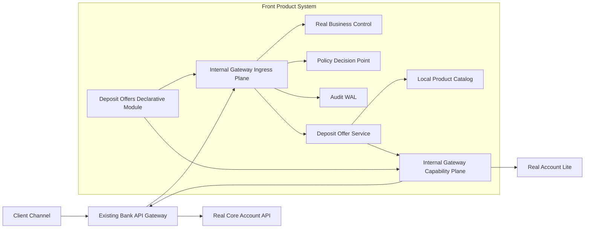

# PoC Internal Gateway и Deposit Offer Service

## Цель пилота
Доказать, что новый продуктовый МС может работать без platform starters/SDK и `lite-service` в classpath, получая платформенные и банковские данные только через Internal Gateway. Gateway должен централизованно выполнять access, Business Control, audit, retries, circuit breaker, общий outbound rate limiting, request coalescing, cache и выбор provider.

PoC этапа 1 ограничивается подбором депозитных предложений по локальному каталогу (admin seed). Создание заявки, подпись и исполнение в Deposit Processor не входят в scope.

**Этап 2 (рекомендуется):** подписка Gateway на Kafka депозитного процессора для синхронизации authoritative catalog (`DepositOfferCreated/Updated/Closed`).

## Целевая схема

Ingress и capability calls могут обслуживаться одним Gateway deployment, но используют разные listeners, connection pools, concurrency budgets и bulkheads. Это предотвращает resource starvation при цепочке `Gateway → Offer Service → Gateway → account provider`.

## Пользовательский сценарий
1. Клиент запрашивает доступные депозитные предложения для организации, счета, суммы и желаемого срока.
2. Банковский API Gateway передает проверенный identity context в Internal Gateway.
3. Gateway загружает deposit-offers module, проверяет schema и вызывает реальный Business Control с набором `deposit.offers.search`.
4. Policy PDP проверяет право пользователя действовать от организации и запрашивать предложения.
5. Gateway фиксирует security/technical audit и передает подписанный identity envelope в Deposit Offer Service.
6. Сервис запрашивает через capability plane актуальный `AccountDepositContext`.
7. Gateway применяет общий rate limit, request coalescing, retry/circuit breaker и выбирает активный provider: `account-lite` либо прямой Core Account API через банковский API Gateway.
8. Сервис читает локальный каталог, применяет продуктовые правила и формирует подходящие предложения.
9. При необходимости отображения организации сервис получает через Gateway кэшируемый `OrganizationDisplayInfo`; состояние счета не кэшируется.
10. Ответ возвращается клиенту с `offerId`, версией продукта, ставкой, сроком действия предложения и источниками snapshot-данных.

## Контракты PoC
- `GET /deposit-products/{productId}/offer-controls` — frontend-описание контролей из Business Control.
- `POST /deposit-offers/search` — безопасный, не создающий состояние поиск предложений.
- `GET /internal/capabilities/accounts/{accountId}/deposit-context` — актуальное состояние счета без кэша.
- `GET /internal/capabilities/organizations/{organizationId}/display-info` — кэшируемое отображаемое имя организации.
- Канонические модели не раскрывают DTO `lite` или банковской системы.

Основой DSL служит [deposit-opening-gateway.dsl.yaml](../dsl/deposit-opening-gateway.dsl.yaml); для PoC из него выделяется отдельный модуль `deposit-offers` без signing/processor routes.

## Deposit Offer Service с нуля
Сервис содержит только продуктовый код:
- локальный каталог активных депозитных продуктов;
- диапазоны сумм и сроков, валюты и rate tiers;
- правила eligibility на основе канонического account context;
- ранжирование предложений;
- срок действия и version snapshot предложения;
- API и продуктовый audit event `DepositOffersCalculated`.

Минимальная модель данных:
- `DepositProduct`: ID, version, currency, active period, min/max amount, allowed terms;
- `RateTier`: amount/term range и interest rate;
- `OfferCalculation`: request fingerprint, product version, account snapshot timestamp, рассчитанные предложения и expiry;
- изменения каталога версионируются; исторический расчет воспроизводим по snapshot/version.

Сервис не содержит IAM, Business Control client, audit SDK, account-lite client, cache/rate-limit libraries платформы или DTO внешних систем.

## Gateway scope PoC
Реализовать только функции, необходимые вертикальному срезу:
- module schema, validation, hot reload и last-known-good rollback;
- два логических data plane: ingress и internal capabilities;
- identity envelope и mTLS;
- Policy, Business Control и audit pipeline;
- provider registry и explicit alias `lite/core`;
- retries только для safe query/transient errors;
- circuit breaker и timeout profiles;
- distributed outbound rate limit по provider/operation со справедливой долей для caller workload;
- request coalescing одинаковых account queries без сохранения результата;
- read-through cache для organization display name с TTL и invalidation;
- traces, metrics и resolved dependency inventory.

Не реализовывать в этапе 1 универсальный workflow engine, пользовательские скрипты в DSL, автоматический fallback между семантически разными providers, signing и processor command integration.

### Этап 6 — Messaging: подписка на Kafka процессора (2–3 недели, после go/no-go этапа 1)
- согласовать Avro/schema `processorDepositOfferEvent` с владельцами Deposit Processor;
- настроить `deposit-processor-kafka` provider set и сертификат в Gateway;
- реализовать consume binding `deposit-processor-offer-lifecycle`;
- добавить HTTP handlers в Deposit Offer Service: offer-created/updated/closed;
- реализовать upsert/deactivate catalog с `processorOfferId` + optimistic `processorOfferVersion`;
- протестировать dedup, out-of-order, closed-offer exclusion из search;
- настроить consumer lag alerts и DLQ replay runbook.

Результат: локальный каталог синхронизируется из authoritative processor Kafka без Kafka client в Offer Service.

## Этапы

### Этап 0 — baseline и контракты, 1–2 недели
- зафиксировать текущий dependency/startup baseline аналогичного МС;
- описать `DepositOffer`, `AccountDepositContext` и `OrganizationDisplayInfo`;
- согласовать Business Control set и policy names;
- определить SLO/нагрузочный профиль PoC;
- выбрать готовый proxy runtime и оформить ADR границ Gateway;
- подготовить тестовые контуры account-lite и Core Account API.

Результат: утвержденные контракты, ADR, dependency graph и измеримый baseline.

### Этап 1 — Gateway foundation, 2 недели
- поднять HA deployment из двух экземпляров;
- реализовать module loader, schema validation, route registry и hot reload;
- разделить ingress/capability listeners и bulkheads;
- подключить identity envelope, mTLS и trace propagation;
- добавить module inventory и базовые dashboards.

Результат: запрос проходит через Gateway в stub Offer Service без platform dependencies.

### Этап 2 — реальные платформенные интеграции, 2–3 недели
- подключить Business Control и fail-closed evaluation;
- подключить Policy PDP и обязательный audit WAL;
- реализовать account provider set с `account-lite` и Core Account API;
- добавить safe retry, circuit breaker, общий rate limit и coalescing;
- добавить organization capability и cache policy;
- выполнить shadow-сравнение ответов lite/core без влияния shadow-ответа на результат.

Результат: Gateway возвращает канонические capability responses и переключает provider конфигурацией без релиза потребителя.

### Этап 3 — Deposit Offer Service, 2–3 недели параллельно
- создать сервис, БД и миграции локального каталога;
- реализовать импорт/administrative seed минимального набора продуктов;
- реализовать подбор, rate tiers, eligibility и versioned offer snapshots;
- интегрироваться только с Internal Gateway contracts;
- публиковать продуктовый audit event через outbox либо PoC-compatible event channel;
- добавить API/contract/component tests.

Результат: полноценный подбор предложений на реальном account context.

### Этап 4 — интеграция и доказательство свойств, 2 недели
- end-to-end и consumer-driven contract tests;
- нагрузочный тест минимум на двух Gateway instances;
- проверить общий rate limit при запросах от нескольких workload;
- доказать coalescing десяти одинаковых одновременных account requests в один downstream call;
- проверить cache hit/invalidation/stale policy организации;
- провести failure injection Business Control, Policy, Audit, lite и Core API;
- выполнить canary `lite → core`, сравнение и rollback;
- измерить startup, latency и classpath нового сервиса.

### Этап 5 — итоги, 1 неделя
- собрать архитектурный отчет и фактические трудозатраты;
- уточнить стоимость production hardening;
- сформировать backlog следующего capability;
- принять go/no-go на масштабирование.

## Команда и оценка
Рекомендуемый состав:
- tech lead/architect — 0,5–1 FTE;
- 2 gateway/backend engineers;
- 2 Deposit Offer Service engineers;
- QA automation/performance engineer — 1 FTE;
- DevOps/SRE — 0,5–1 FTE;
- IAM, Business Control, security и владельцы account systems — part-time.

Оценка PoC: 180–300 чел.-дн., календарно 8–12 недель при параллельной работе 5–7 человек.

Разбивка:
- Gateway foundation и DSL: 55–85 чел.-дн.;
- Policy, Business Control, audit и identity: 30–45;
- account/org providers, resilience, limits и cache: 30–50;
- Deposit Offer Service и каталог: 40–65;
- infrastructure, tests, performance и failure scenarios: 25–55.

Production hardening после успешного PoC предварительно потребует еще 150–300 чел.-дн.: DR, security certification, расширенная эксплуатация, capacity model, upgrade policy и сопровождение DSL.

## Критерии успеха
- в dependency tree Deposit Offer Service отсутствуют platform starters/SDK и lite clients;
- переключение `account-lite → Core Account API` выполняется конфигурацией Gateway без rebuild/restart Offer Service;
- Business Control реально проверяет frontend/backend-simple controls и возвращает versioned evidence;
- состояние счета никогда не отдается из cache;
- десять параллельных одинаковых account queries дают не более одного одновременного downstream-вызова;
- общий outbound budget соблюдается суммарно для нескольких МС и Gateway instances;
- organization display cache корректно авторизуется, инвалидируется и не содержит лишних данных;
- safe retries не вызывают повторных side effects;
- resolved dependency graph и provider видны в traces/metrics;
- чистый overhead Gateway p95 не превышает согласованный бюджет, старт Offer Service существенно быстрее baseline;
- Spring/platform upgrade Gateway не требует пересборки Offer Service при неизменном контракте;
- canary и rollback provider выполняются без изменения продуктового кода.
- processor offer events Created/Updated/Closed синхронизируют каталог через Gateway (этап 2).

## Риски и контроль
- Gateway становится SPOF — HA, разные failure domains, bulkheads и capacity test.
- Циклический путь `Gateway → Service → Gateway` исчерпывает ресурсы — отдельные listeners/pools/concurrency budgets.
- DSL превращается в язык программирования — только declarative schema/policy/profile references, без scripts/functions.
- Business Control или Policy увеличивают latency — отдельные budgets, metrics и fail-closed behavior.
- Ответы lite/core семантически различаются — canonical contract, shadow comparison и ручное controlled cutover без автоматического fallback.
- Distributed rate limiter создает новую зависимость — выбрать отказоустойчивый counter backend либо распределяемые Gateway budget leases; проверить degradation mode.
- Cache раскрывает данные между организациями — authorization before lookup, tenant-aware key и allowlist полей.