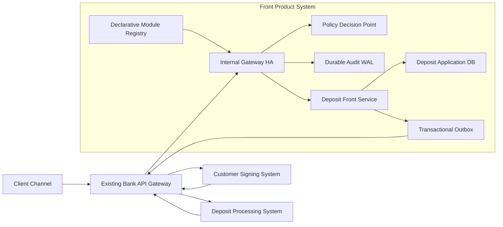
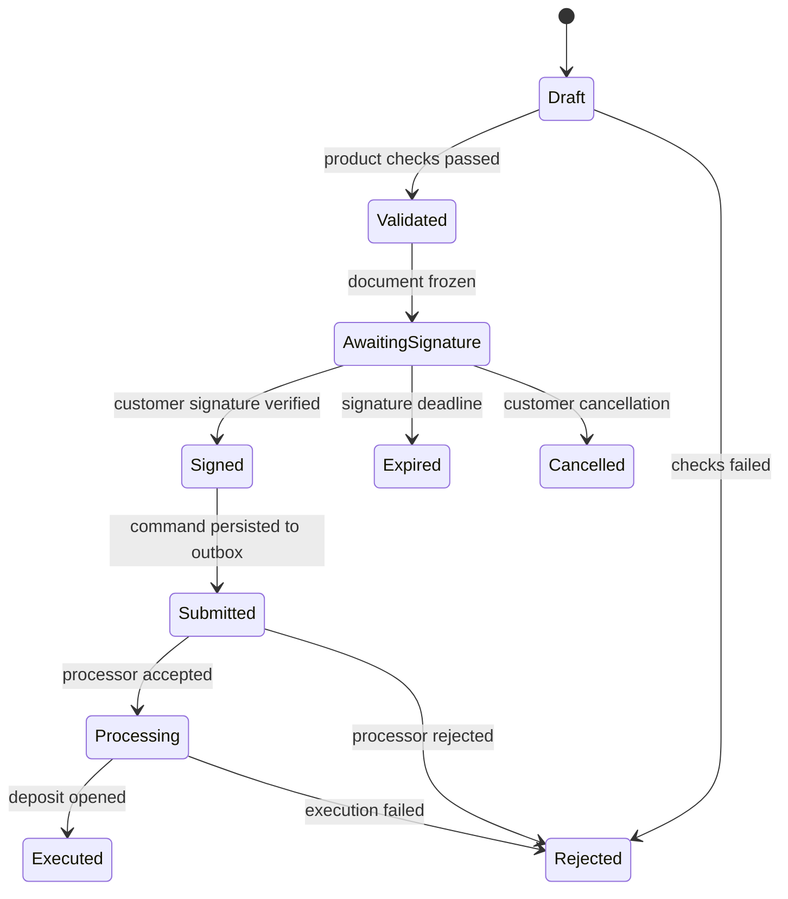

# Internal Gateway с декларативными продуктовыми модулями

## 1. Назначение и границы
- Internal Gateway находится внутри фронтальной продуктовой системы после существующего банковского API Gateway.
- Каждый продуктовый МС публикует декларативный модуль: endpoints, schema, policy references, audit и resilience profiles.
- Gateway выполняет единообразный enforcement и проксирует запрос в продуктовый МС.
- Продуктовый МС владеет заявкой, состоянием процесса и продуктовыми правилами.
- Система-процессор депозитов остается владельцем договора/депозита и фактического исполнения.
- Межсистемные вызовы Gateway и фронтальных МС по-прежнему проходят через существующий банковский API Gateway.
- Java/Spring SDK бывшей платформы и `lite-service` не подключаются к продуктовым МС.

## 2. Контекстная архитектура

Internal Gateway — синхронный enforcement/proxy. Deposit Front Service — application workflow/state machine. Асинхронный outbox обеспечивает передачу подписанной заявки процессору и прием статусов без распределенной транзакции.

## 3. Устройство Internal Gateway

### Data plane
- route matching и выбор активной версии product module;
- OpenAPI/JSON Schema validation;
- проверка обязательного identity context;
- обращение в Policy Decision Point;
- security/technical audit до и после вызова;
- rate limit, timeout, retry и circuit breaker по именованному profile;
- формирование подписанного internal identity envelope;
- proxy в целевой продуктовый МС;
- trace/correlation/operation ID propagation;
- стандартизованное отображение технических ошибок.

Gateway не имеет продуктовой БД, не хранит заявку, не управляет state machine и не вызывает систему-процессор от имени Deposit Front Service.

### Control/config plane
- registry версионированных декларативных модулей;
- schema validation, route conflict detection и policy/profile reference validation;
- независимые canary, activation и rollback модуля;
- runtime inventory: module version → route → policy → target → downstream profile;
- подписанная доставка конфигурации и last-known-good snapshot.

### HA и изоляция
- минимум два экземпляра Gateway по разным failure domains;
- stateless routing; локальное состояние ограничено кэшем конфигурации;
- bulkhead и отдельные connection pools по product module/target;
- лимиты CPU, concurrency и request size на модуль;
- отказ/перегрузка депозитного target не исчерпывает ресурсы остальных модулей;
- health готовности учитывает валидную конфигурацию, но не требует доступности всех targets.

## 4. Декларативный модуль Deposit Front Service
Модуль принадлежит команде Deposit Front Service и поставляется независимо от gateway binary.

Он описывает:
- `POST /deposit-applications` → создать заявку;
- `GET /deposit-applications/{id}` → получить состояние;
- `POST /deposit-applications/{id}/signing-session` → начать клиентское подписание;
- `POST /deposit-applications/{id}/execute` → передать уже подписанную заявку на исполнение, если запуск не автоматический;
- request/response schema;
- policy references: `deposit.application.create/read/sign/execute`;
- обязательные identity claims и target audience;
- audit events и правила masking;
- idempotency requirements;
- rate-limit/resilience profiles;
- owner, SLA, compatibility и rollout metadata.

Модуль не содержит:
- Java-кода, Spring dependencies, scripts и пользовательских функций;
- SQL, сетевых вызовов и циклов;
- продуктовых лимитов, тарифов и eligibility;
- workflow переходов заявки;
- вызовов Signing System или Deposit Processor.

Расширение DSL проходит отдельный architecture/security review. Если требование нельзя выразить schema или ссылкой на policy, оно реализуется в Deposit Front Service.

## 5. Identity и trust boundary
- Банковский API Gateway аутентифицирует пользователя и передает проверенный внешний security context.
- Internal Gateway проверяет источник, выполняет token exchange и создает короткоживущий подписанный envelope для `Deposit Front Service`.
- Минимальные claims: `subjectId`, `organizationId`, `delegation`, `roles/entitlements snapshot`, `authStrength`, `sessionId`, `operationId`, `audience`, `issuedAt`, `expiresAt`.
- Gateway и Deposit Front Service используют mTLS; сервис проверяет signature, audience, issuer и TTL.
- `accountId`, `productId`, `amount` и `term` из payload являются пользовательским вводом, а не доверенными identity claims.
- Для межсистемной команды процессору фронтальная система использует service identity; бизнес-субъект и customer signature evidence передаются как данные команды.

## 6. Граница авторизации и валидации

Internal Gateway:
- имеет ли субъект entitlement создать депозитную заявку;
- вправе ли он действовать от указанной организации;
- заполнены ли обязательные поля;
- корректны ли типы, формат, `amount > 0`, `term > 0`;
- не превышены ли технические rate limits.

Deposit Front Service:
- доступен ли выбранный продукт клиенту/организации;
- разрешены ли валюта, срок и сумма условиями продукта;
- принадлежит ли счет организации и разрешено ли списание;
- не истекло ли предложение и не изменились ли условия;
- нет ли активной дублирующей заявки;
- допустим ли текущий переход state machine;
- соответствует ли подписанный документ исполняемой заявке.

Schema-проверки могут выполняться и в Gateway, и в сервисе. Deposit Front Service остается authoritative для всех продуктовых инвариантов и не доверяет входу только на основании прохождения Gateway.

## 7. State machine депозитной заявки

Правила:
- только Deposit Front Service изменяет состояние заявки;
- каждый переход выполняется транзакционно вместе с domain event/outbox record;
- переход имеет expected current state и optimistic version;
- повтор команды с тем же idempotency key возвращает прежний результат;
- после `Validated` фиксируется immutable snapshot продукта, условий и документа;
- после `Signed` изменение значимых полей запрещено — требуется новая версия заявки и новая подпись.

## 8. Подробный процесс открытия депозита

### Этап A — создание и продуктовые проверки
1. Клиент отправляет команду через банковский API Gateway.
2. Internal Gateway загружает deposit module, валидирует schema и idempotency key.
3. Policy PDP проверяет `deposit.application.create`; при ошибке или недоступности применяется fail-closed.
4. Gateway записывает `AccessGranted/Denied` и `RequestAccepted/Rejected` в durable audit channel.
5. Gateway выпускает identity envelope и проксирует команду в Deposit Front Service.
6. Сервис проверяет продукт, организацию, счет, сумму, срок и отсутствие дубля.
7. В одной транзакции создаются заявка `Draft/Validated`, snapshot условий и outbox event.

### Этап B — подготовка и клиентская подпись
1. Deposit Front Service формирует канонический документ и его cryptographic hash.
2. Сохраняются template/version, document hash, application version и signer requirements.
3. Заявка переходит в `AwaitingSignature`.
4. Через существующий банковский API Gateway создается signing session в Customer Signing System.
5. Клиент подписывает документ.
6. Callback/event от Signing System проходит банковский API Gateway и Internal Gateway по отдельному декларативному route.
7. Deposit Front Service проверяет signature evidence, signer authority, document hash, application version, срок и отсутствие отзыва.
8. Заявка переходит в `Signed`; signature evidence сохраняется неизменяемо.

### Этап C — асинхронное исполнение
1. В транзакции `Signed → Submitted` создается outbox-команда `ExecuteDepositApplication`.
2. Dispatcher отправляет команду через банковский API Gateway в Deposit Processor.
3. Ключ идемпотентности — стабильный `applicationId` плюс `applicationVersion`; повторная доставка безопасна.
4. Синхронный ответ означает только `accepted/rejected for processing`, но не успешное открытие депозита.
5. При acceptance заявка переходит в `Processing`.
6. Processor асинхронно отправляет `DepositExecuted` либо `DepositExecutionRejected`.
7. Consumer проверяет event ID, aggregate version и допустимость перехода; дубликаты игнорируются, события не по порядку буферизуются/сверяются запросом статуса.
8. При успехе фронт сохраняет processor deposit ID и состояние `Executed`; при отказе — нормализованный reason и `Rejected`.
9. Клиент получает статус через polling/push-механизм фронтальной системы.

## 9. Аудит
Gateway создает security/technical audit:
- кто и от имени какой организации вызвал endpoint;
- policy decision и reason;
- module/route version;
- request classification без секретов;
- target, latency и технический outcome.

Deposit Front Service создает business audit:
- заявка создана и условия зафиксированы;
- документ подготовлен;
- подпись проверена;
- заявка передана процессору;
- процессор принял/исполнил/отклонил;
- бизнес-причина каждого отказа.

Все записи используют `operationId`, `applicationId`, `traceId` и actor identity. Секреты, полный документ и подпись не копируются в audit payload; сохраняются ссылки, hashes и metadata. Бизнес-аудит публикуется через transactional outbox.

## 10. Ошибки и восстановление
- Policy недоступен: fail-closed, команда не поступает в Deposit Front Service.
- Audit до proxy недоступен: для обязательного аудита fail-closed; локальный HA WAL позволяет считать запись принятой без ожидания центрального sink.
- Deposit Front Service недоступен: Gateway не повторяет неидемпотентный POST без idempotency key.
- Signing System недоступен: заявка остается `Validated/AwaitingSignature`, повтор создается по стабильному application ID.
- Callback подписи доставлен повторно: deduplication по signature event ID и application version.
- Deposit Processor недоступен: outbox повторяет отправку с exponential backoff, jitter и retry budget; заявка остается `Submitted`.
- Processor принял команду, но ответ потерян: повтор с тем же idempotency key либо status reconciliation.
- Callback процессора потерян: периодический reconciliation по заявкам `Submitted/Processing`.
- Некорректный/неизвестный статус: dead-letter/quarantine и операционный alert, состояние заявки автоматически не меняется.

## 11. Контракты
- Внешний front API версионируется существующим банковским API Gateway.
- Deposit module и target contract версионируются независимо; Gateway поддерживает минимум current/previous active module.
- Изменения schema по умолчанию additive; удаление поля проходит deprecation window.
- Асинхронные события содержат `eventId`, `eventType`, `schemaVersion`, `occurredAt`, `applicationId`, `applicationVersion`, `causationId`, `correlationId`.
- Команда процессору содержит immutable product snapshot reference/hash, сумму, валюту, срок, funding account, customer/org IDs и signature evidence reference.
- Внутренние ошибки разделены на validation, forbidden, conflict, temporary unavailable и internal; бизнес-причины не превращаются в gateway-specific exceptions.

## 12. Ownership
- Internal Gateway team: runtime, DSL, module registry, HA, security envelope, observability.
- Deposit Front team: deposit module, API contract, application workflow, product checks, outbox, reconciliation.
- IAM/Policy team: policy definitions и PDP SLA.
- Audit team: audit schema, retention и central sink.
- Signing System: signature evidence и проверяемый callback contract.
- Deposit Processor: исполнение, idempotency и lifecycle фактического депозита.

Продуктовая команда может менять endpoint/module без релиза Gateway, но не может добавлять исполняемый gateway-код.

## 13. Наблюдаемость и SLO
- отдельные latency/error/saturation metrics по module, route, policy и target;
- trace от банковского API Gateway до Deposit Front Service и межсистемной команды;
- dashboards по состояниям и age депозитных заявок;
- alerts на рост `Submitted/Processing`, outbox lag, reconciliation mismatch и audit lag;
- журнал активных module versions и config rollout;
- рекомендуемый latency budget Internal Gateway задается отдельно от Deposit Front Service и внешних систем;
- SLO availability Gateway должен быть не ниже максимального SLO обслуживаемых фронтальных операций.

## 14. Проверки поставки
- schema/DSL lint и запрет executable expressions;
- route collision и ownership validation;
- policy/audit/resilience profile reference checks;
- consumer-driven contract tests Gateway → Deposit Front Service;
- contract tests фронта с Signing System и Deposit Processor;
- state-machine/property tests, idempotency и out-of-order events;
- security tests identity envelope, replay, audience и mTLS;
- failure injection Policy/Audit/Signing/Processor;
- performance test startup Gateway с полным набором модулей и route lookup под нагрузкой.

## 15. Миграция
1. Построить фактический dependency/runtime graph текущего депозитного пути.
2. Зафиксировать legacy semantics и контракт депозитного endpoint.
3. Создать deposit declarative module и proxy в текущую реализацию без изменения поведения.
4. Вынести access, technical audit и resilience в Gateway; включить shadow comparison.
5. Реализовать Deposit Front state machine, identity envelope и transactional outbox.
6. Перевести signing callback и processor events на новые маршруты.
7. Провести canary, сверить policy/audit/business outcomes и latency.
8. Удалить из Deposit Front Service platform starters/SDK и прямые вызовы `lite-service`.
9. Запретить возврат зависимостей dependency allowlist/architecture tests.

## 16. Критерии успешного пилота
- Deposit Front Service запускается без платформенных starters и `lite-service`.
- Изменение обратно совместимого module/policy не требует пересборки Deposit Front Service или Gateway.
- Полный route → policy → target → processor graph виден в runtime inventory/traces.
- Ни одна заявка не исполняется без валидной клиентской подписи точной версии документа.
- Повторные команды/callbacks не создают второй депозит и не ломают state machine.
- Потеря ответа процессора восстанавливается idempotent retry/reconciliation.
- Обязательный аудит не теряется при временной недоступности central sink.
- p95 overhead Gateway и startup time соответствуют согласованному бюджету.
- Обновление Spring/platform слоя не требует полной регрессии Deposit Front Service при неизменном контракте.